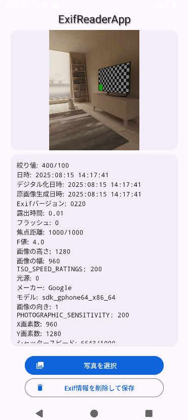

# ExifReaderApp

画像のExif情報を読み取って表示するシンプルなAndroidアプリケーションです。

    

## ✨ 機能

*   デバイスから画像を選択
*   選択した画像のExif情報を表示
*   Exif情報を削除した画像を保存

## 🛠️ 技術スタック

このプロジェクトで使用されている主要な技術は以下の通りです。

*   **言語:** [Kotlin](https://kotlinlang.org/)
*   **プラットフォーム:** [Android](https://developer.android.com/)
*   **UI:**
    *   [Material Components for Android](https://material.io/develop/android) - GoogleのMaterial Designガイドラインに準拠したUIコンポーネント
    *   [ViewBinding](https://developer.android.com/topic/libraries/view-binding) - レイアウトファイル内のビューを安全に参照
    *   [ConstraintLayout](https://developer.android.com/training/constraint-layout) - 柔軟でレスポンシブなレイアウトを構築
*   **アーキテクチャ:**
    *   [Android Architecture Components](https://developer.android.com/topic/libraries/architecture)
        *   [ViewModel](https://developer.android.com/topic/libraries/architecture/viewmodel) - UI関連のデータをライフサイクルを意識して管理
        *   [Lifecycle](https://developer.android.com/topic/libraries/architecture/lifecycle) - ライフサイクル状態の変化に対応
*   **非同期処理:**
    *   [Kotlin Coroutines](https://kotlinlang.org/docs/coroutines-guide.html) - 非同期処理を簡潔に記述
*   **画像処理:**
    *   [Glide](https://github.com/bumptech/glide) - 画像の読み込みと表示
    *   [ExifInterface](https://developer.android.com/reference/androidx/exifinterface/media/ExifInterface) - 画像のExifメタデータの読み書き
*   **ビルド:**
    *   [Gradle](https://gradle.org/) (Kotlin DSL)

## 🚀 セットアップ

1.  このリポジトリをクローンします。
2.  Android Studioでプロジェクトを開きます。
3.  Gradleの同期が完了したら、ビルドして実行します。

## 📄 ライセンス

このプロジェクトはMITライセンスの下で公開されています。

### サードパーティライブラリ

このプロジェクトでは、以下のサードパーティライブラリを使用しています。それぞれのライセンスに従ってご利用ください。

| ライブラリ                                                                                                 | ライセンス                                                                       |
|-------------------------------------------------------------------------------------------------------|-----------------------------------------------------------------------------|
| [Kotlin](https://kotlinlang.org/)                                                                     | [Apache License 2.0](https://www.apache.org/licenses/LICENSE-2.0)           |
| [AndroidX Libraries](https://developer.android.com/jetpack/androidx)                                  | [Apache License 2.0](https://www.apache.org/licenses/LICENSE-2.0)           |
| [Material Components for Android](https://github.com/material-components/material-components-android) | [Apache License 2.0](https://www.apache.org/licenses/LICENSE-2.0)           |
| [Kotlin Coroutines](https://github.com/Kotlin/kotlinx.coroutines)                                     | [Apache License 2.0](https://www.apache.org/licenses/LICENSE-2.0)           |
| [Glide](https://github.com/bumptech/glide)                                                            | [Apache License 2.0](https://github.com/bumptech/glide/blob/master/LICENSE) |
| [JUnit](https://junit.org/junit4/)                                                                    | [Eclipse Public License 1.0](https://www.eclipse.org/legal/epl-v10.html)    |

**注:** 正確なライセンス情報については、各ライブラリの公式ドキュメントをご確認ください。